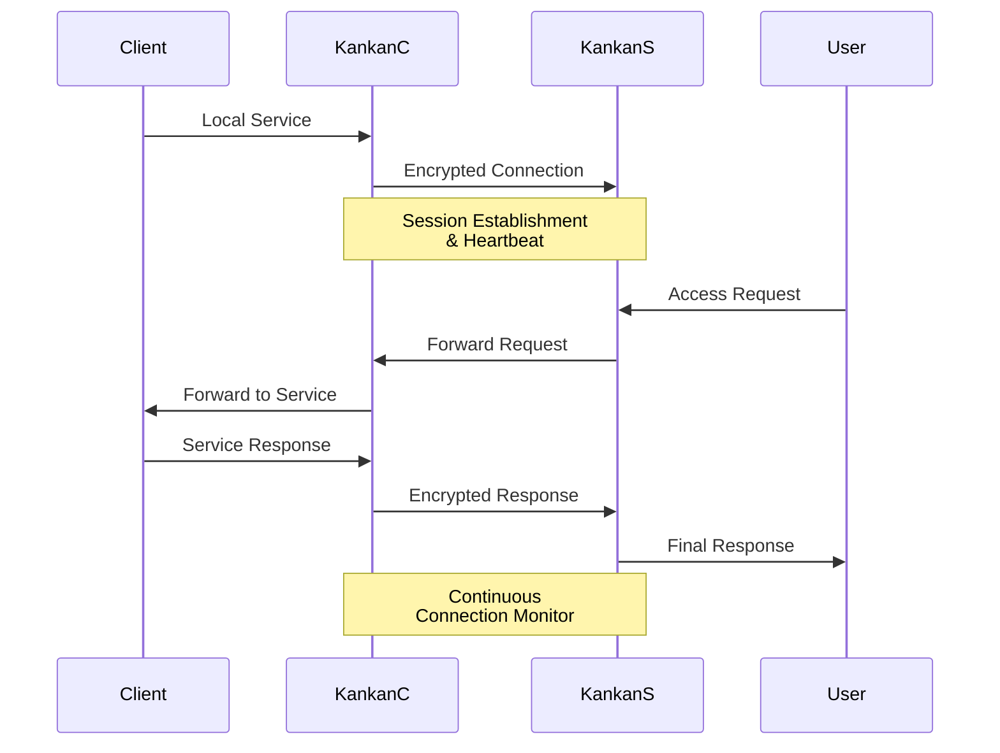

# Kankan

[](https://golang.org/doc/devel/release.html)
[](https://opensource.org/licenses/MIT)

Kankan is a lightweight and secure intranet penetration tool written in Go.

## Usage

### Server (Public Network)

```bash
# Basic usage
kankans.exe -bind 0.0.0.0 -port 8080 -proxy 8081 -key your-secret-key

# Advanced configuration
kankans.exe -bind 0.0.0.0 -port 8080 -proxy 8081 -key your-secret-key -max-conn 100 -timeout 30s -heartbeat 10s -buffer 4096
```

### Client (Internal Network)

```bash
# Basic usage - Expose local web service (TCP mode)
kankanc.exe -server your-server-ip -sport 8080 -local 127.0.0.1 -lport 80 -key your-secret-key

# UDP mode - Expose local UDP service
kankanc.exe -server your-server-ip -sport 8080 -local 127.0.0.1 -lport 53 -key your-secret-key -udp

# Advanced configuration
kankanc.exe -server your-server-ip -sport 8080 -local 127.0.0.1 -lport 80 -key your-secret-key -max-retry 5 -retry-delay 5s -buffer 8192
```

## How It Works



The diagram above illustrates the basic workflow:
1. KankanC establishes an encrypted connection with KankanS
2. KankanC maintains the connection through heartbeat mechanism
3. When a user accesses KankanS, the request is forwarded to KankanC
4. KankanC forwards the request to the local service and returns the response
5. All data transmission between KankanC and KankanS is encrypted

## Command Line Options

### Server Options
- `-bind`: Bind address (default: "0.0.0.0")
- `-port`: Control server port (default: 8080)
- `-proxy`: Proxy server port (default: 8081)
- `-key`: Encryption key (required)
- `-max-conn`: Maximum connections (default: 1000)
- `-timeout`: Connection timeout (default: 30s)
- `-heartbeat`: Heartbeat interval (default: 10s)
- `-buffer`: Buffer size in bytes (default: 4096)
- `-cleanup`: Cleanup interval (default: 60s)
- `-log-level`: Log level (debug/info/warn/error, default: info)
- `-idle-timeout`: Idle connection timeout (default: 300s)

### Client Options
- `-server`: Remote server address (required)
- `-sport`: Remote server port (default: 8080)
- `-local`: Local service address (default: "127.0.0.1")
- `-lport`: Local service port (required)
- `-key`: Encryption key (required)
- `-udp`: Enable UDP mode for UDP service forwarding
- `-max-retry`: Maximum reconnection attempts (default: 3)
- `-retry-delay`: Delay between reconnection attempts (default: 3s)
- `-buffer`: Buffer size in bytes (default: 4096)