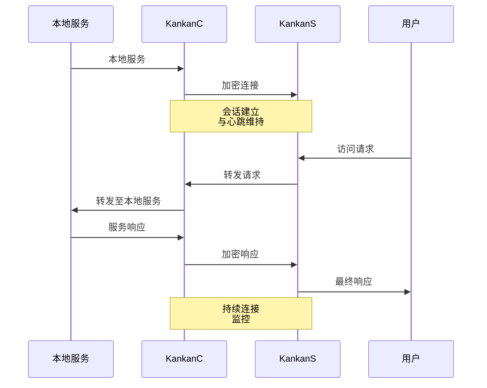

# Kankan

[](https://golang.org/doc/devel/release.html)
[](https://opensource.org/licenses/MIT)

Kankan 是一个使用 Go 语言编写的轻量级安全内网穿透工具。

## 使用方法

### 服务端（公网）

```bash
# 基础用法
kankans.exe -bind 0.0.0.0 -port 8080 -proxy 8081 -key your-secret-key

# 高级配置
kankans.exe -bind 0.0.0.0 -port 8080 -proxy 8081 -key your-secret-key -max-conn 100 -timeout 30s -heartbeat 10s -buffer 4096
```

### 客户端（内网）

```bash
# 基础用法 - 暴露本地Web服务（TCP模式）
kankanc.exe -server your-server-ip -sport 8080 -local 127.0.0.1 -lport 80 -key your-secret-key

# UDP模式 - 暴露本地UDP服务
kankanc.exe -server your-server-ip -sport 8080 -local 127.0.0.1 -lport 53 -key your-secret-key -udp

# 高级配置
kankanc.exe -server your-server-ip -sport 8080 -local 127.0.0.1 -lport 80 -key your-secret-key -max-retry 5 -retry-delay 5s -buffer 8192
```

```powershell
kankanc.exe -server your-server-ip -sport 8080 -local 127.0.0.1 -lport 80 -key your-secret-key
```

## 功能特色

### 安全性
- 使用 AES-256 加密和动态随机数保护数据
- 基于 SHA-256 的密钥派生确保密钥安全
- 消息认证防止篡改
> 路径：`/pkg/crypto/crypto.go`
```go
func NewCrypto(key string) (*Crypto, error) {
    h := sha256.New()
    h.Write([]byte(key))
    keyBytes := h.Sum(nil)
    block, err := aes.NewCipher(keyBytes)
    // ...
}
```

### 流量混淆
- HTTP/WebSocket 协议模拟
- 动态填充和抖动
- 常见浏览器 User-Agent 轮换
- 类 TLS 流量特征
> 路径：`/pkg/protocol/protocol.go`
```go
type ObfuscationConfig struct {
    EnableHTTP    bool
    EnableWSS     bool
    PaddingRange  [2]int
    JitterRange   time.Duration
    FragmentSize  int
    EnableTLSLike bool
    DynamicPort   bool
    PortRange     [2]int
}
```

### 性能优化
- 工作池高效处理连接
- 缓冲池优化内存使用
- LZ4 数据压缩传输
> 路径：`/kankans/main.go`
```go
type Server struct {
    workerPool  *WorkerPool
    bufferPool  sync.Pool
    metrics     *Metrics
    // ...
}

bufPool: sync.Pool{
    New: func() interface{} {
        return make([]byte, 0, 4096)
    },
}
```

### 协议支持
- TCP 代理和自动重连
- UDP 代理及会话管理
- 动态端口分配
> 路径：`/kankans/main.go`
```go
type UDPSession struct {
    clientAddr *net.UDPAddr
    localConn  *net.UDPConn
    lastSeen   time.Time
    crypto     *crypto.Crypto
}
```

### 监控管理
- 实时指标收集
- 连接和流量统计
- 自动清理非活动会话
> 路径：`/kankans/main.go`
```go
type Metrics struct {
    activeConnections int32
    totalConnections  uint64
    totalBytes        uint64
    totalPackets      uint64
    lastMinuteBytes   uint64
    lastMinutePackets uint64
    // ...
}
```

## 工作原理



上图展示了基本的工作流程：
1. KankanC 与 KankanS 建立加密连接
2. KankanC 通过心跳机制维持连接
3. 当用户访问 KankanS 时，请求被转发到 KankanC
4. KankanC 将请求转发到本地服务并返回响应
5. KankanC 和 KankanS 之间的所有数据传输都是加密的

## 命令行选项

### 服务端选项
- `-bind`：绑定地址（默认："0.0.0.0"）
- `-port`：控制服务器端口（默认：8080）
- `-proxy`：代理服务器端口（默认：8081）
- `-key`：加密密钥（必需）
- `-max-conn`：最大连接数（默认：1000）
- `-timeout`：连接超时时间（默认：30s）
- `-heartbeat`：心跳间隔（默认：10s）
- `-buffer`：缓冲区大小（字节）（默认：4096）
- `-cleanup`：清理间隔（默认：60s）
- `-log-level`：日志级别（debug/info/warn/error，默认：info）
- `-idle-timeout`：空闲连接超时（默认：300s）

### 客户端选项
- `-server`：远程服务器地址（必需）
- `-sport`：远程服务器端口（默认：8080）
- `-local`：本地服务地址（默认："127.0.0.1"）
- `-lport`：本地服务端口（必需）
- `-key`：加密密钥（必需）
- `-udp`：启用UDP模式用于UDP服务转发
- `-max-retry`：最大重连尝试次数（默认：3）
- `-retry-delay`：重连尝试间隔时间（默认：3s）
- `-buffer`：缓冲区大小（单位：字节，默认：4096）
